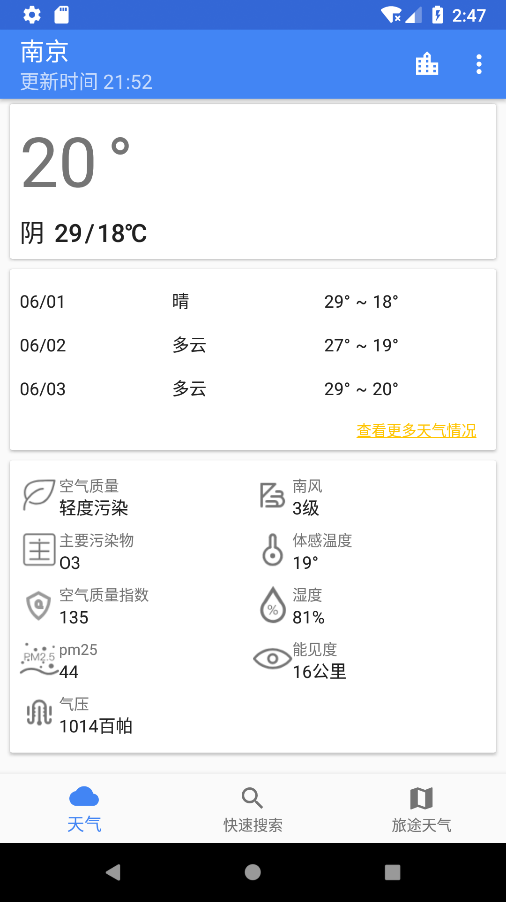
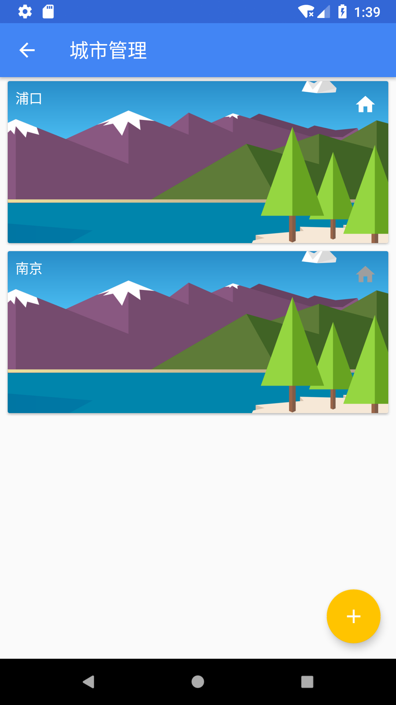
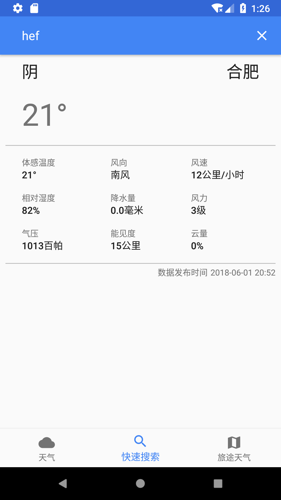
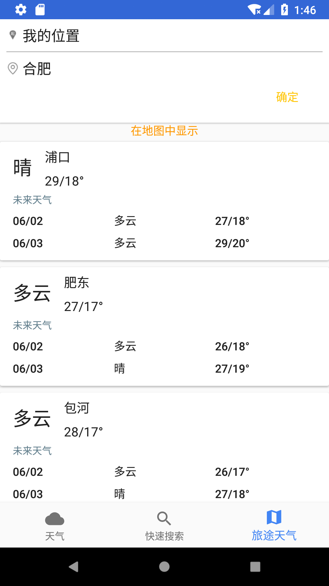
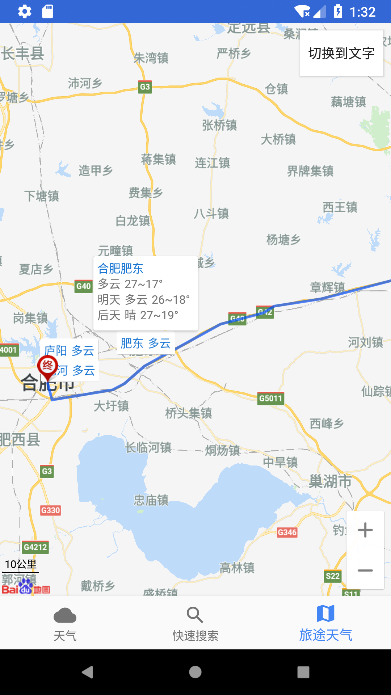
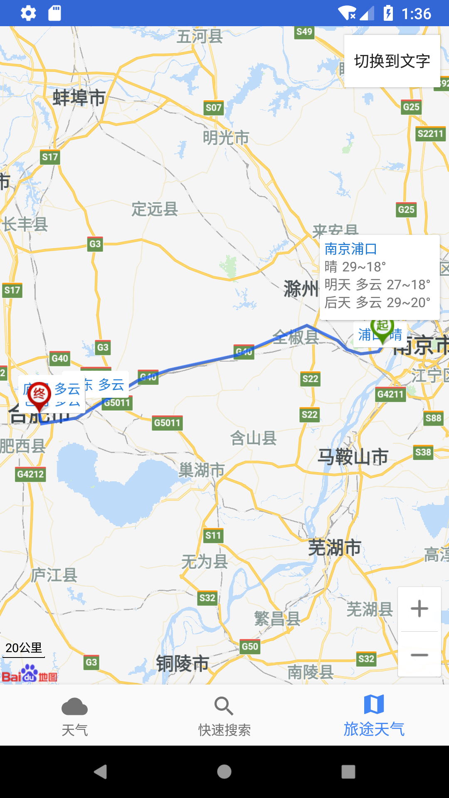

#coolweather

###天气数据来源 [和风天气](www.heweather.com)

###运行须知
+ 需要自己提供.jks签名文件
+ 如需正常使用定位功能,请将AndroidMainfest中的com.baidu.lbsapi.API_KEY更换为自己申请的百度地图key.

###所用到的技术或工具
+ Android MVP
+ Material Design
+ okhttp3网络请求框架
+ 超级好用的日志管理工具[Klog](https://github.com/zhaokaiqiang/klog)

###所参考的项目
Google官方的mvp学习项目[todo-mvp](https://github.com/googlesamples/android-architecture/tree/todo-mvp/)

###运行截图
+ 
+ 
+ 
+ 
+ 
+ 
+ 

###初次学习
